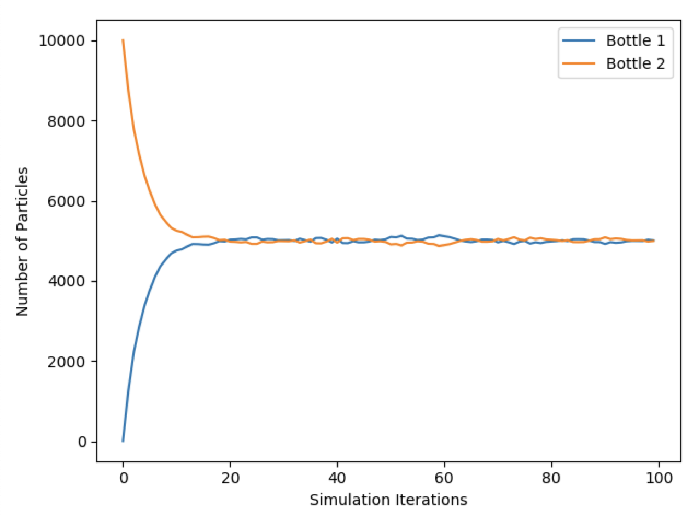

# Simple-Equilibrium-Simulation

Most of us know that gases tend to flow from high pressure to low pressure (that's why, if you open the airlock on a spacecraft, you'll find that the air is "ripped" out of your lungs. I recently realized, however, that despite this fact having been beaten into my skull during my mechanical engineering undergrad, I've never really stopped to think about an intuitive reason for **why** this might be the case.

Here's a tiny Python program that I hope can illustrate why this behavior might arise. It's a super duper simple implementation, but illustrates what, to me, is an interesting fact: that this high-to-low flow can be explained, in large part, by **randomness**.

Let me explain what's going on. First, some background: the movement of particles in a gas is **extremely** chaotic– in fact, in many models such as the [Kinetic Theory of Gas](https://chem.libretexts.org/Bookshelves/Physical_and_Theoretical_Chemistry_Textbook_Maps/Map%3A_Physical_Chemistry_for_the_Biosciences_(Chang)/02%3A_Properties_of_Gases/2.6%3A_Kinetic_Theory_of_Gases), its movement is represented as pure randomness.

Given this, let's imagine we have two bottles containing some gas-- let's say Hydrogen. Bottle #1 contains low pressure, and since pressure in a volume is a function of the number of moles of a gas contained within that volume (see the ideal gas law for an explanation as to why), Bottle #1 contains few hydrogen atoms-- let's say it has 10. Bottle #2 contains high pressure, and has a large number of hydrogen atoms-- 10,000.

What happens when we connect the two bottles together? Well, to get some intuition, let's first make a **massive** assumption here: that particles in either bottle have a certain probability of transitioning between one bottle to another. So for every single particle in both bottles, at every timestep, a dice is rolled– and if the dice hits a certain number, the particle switches botles, and if it doesn't, the particle stays.

Given this assumption, what should happen? Well, after a short amount of time, we should actually see the number particles in each bottle **equalize**. It'll look something like this:


 

That's because in the high pressure bottle, there are so many particles making the same dice rolls. Let's say the transition probability is 10%– then, on average, 10% of the particles should move from Bottle #2 to bottle #1, and back. Since the number of particles in Bottle #2 starts out 10,000 and the number for #1 is 10, then that means that at every time step, 1,000 particles are moving from Bottle #2 to #1, while only 1 particle moves from Bottle #1 to #2. Pretty quickly, we see the numebr of particles in each bottle equalizing!

Play with the simulation yourself to experiment with more values. To run the sim, do (you'll need matplotlib):

```bash
python equilibrium.py
```

**Optional arguments:**
```bash
--bottle_1_num INT #Sets the initial number of particles in Bottle #1. Default: 10.
--bottle_2_num INT #Sets the initial number of particles in Bottle #2. Default: 10,000.
--transition_likelihood FLOAT #Sets the likelihood of a particle transitioning 
#from Bottle #1 to #2, or vice versa, at every timestep. Default: 0.125.
--iterations INT #Sets the number of simulation iterations. Default: 100.
```

*Note: this simulation makes some pretty drastic simplifications, so much so that it can hardly be called a simulation. One of the big things I'm assuming here is that transition probabilities can be modeled a constant probability for all particles – either a particle switches bottles, or it doesn't, with the same probability for every particle. In reality, a particle's likelihood of moving to a certain place will be in part a function of how far away the place is from where the particle currently is. As such, particles closer to the hole between the bottles will have a higher likelihood of transitioning than particles further away from the hole. Please read a physics textbook for an actual education in how this works.
